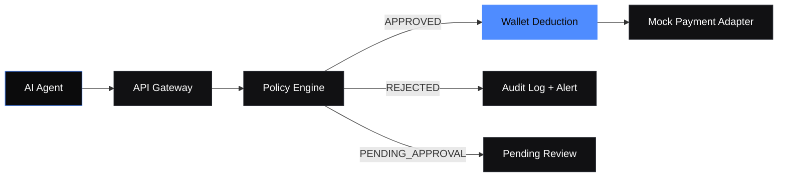
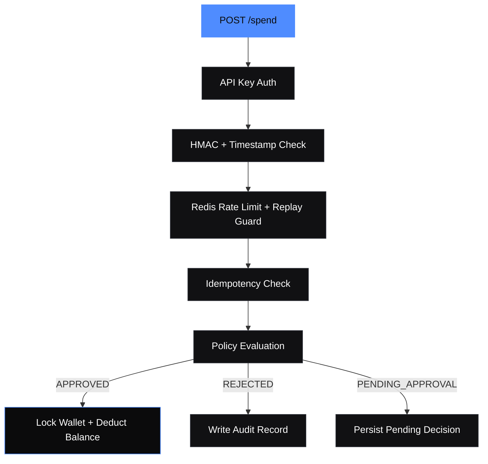

# Aegis Layer

Aegis Layer is a production-style control plane for AI agent payments. It enforces spending policy, blocks misuse, records every decision, and exposes a minimal operational UI for governance and auditability.

## Visual Overview





## Stack
- Backend: FastAPI, SQLAlchemy, Alembic, PostgreSQL, Redis
- Frontend: Next.js, TailwindCSS
- Tests: pytest, pytest-asyncio
- Deployment: Railway or Render for backend, Vercel for frontend, Supabase PostgreSQL for data

## Production Posture
- PostgreSQL and Redis are required at runtime.
- No SQLite fallback exists in the application runtime.
- No in-memory Redis fallback exists in the application runtime.
- Database migrations are required before first launch.
- Security headers and request-size limits are enforced by the API.
- Frontend uses a strict Content Security Policy.

## Repository Layout
- backend: API, domain services, models, migrations, tests, scripts
- frontend: dashboard, transactions, policy editor, alerts UI
- docs: architecture, workflows, security, runtime verification, testing, technical reference
- .github: CI and dependency/security automation

## Core Capabilities
- Agent creation with one-time API key generation
- Wallet funding and balance tracking
- Strict policy evaluation
- Signed spend requests with HMAC and freshness validation
- Idempotency protection
- Redis-backed rate limiting and velocity checks
- Immutable audit logging
- Mock payment adapter for demo execution

## Local Development Prerequisites
- Python 3.11+
- Node.js 20+
- PostgreSQL
- Redis

## Backend Setup
1. Create backend environment file from the example.
2. Set `DATABASE_URL` to PostgreSQL.
3. Set `REDIS_URL` to Redis.
4. Install dependencies.
5. Apply Alembic migrations.
6. Seed demo data if needed.
7. Start the API.

Example commands:

```bash
cd backend
python -m venv .venv
.venv\\Scripts\\activate
pip install -r requirements.txt
alembic upgrade head
python -m scripts.seed
uvicorn app.main:app --reload --port 8000
```

## Frontend Setup
1. Create `frontend/.env.local` from the example.
2. Set `NEXT_PUBLIC_API_URL` to the backend base URL.
3. Install dependencies.
4. Start the Next.js app.

Example commands:

```bash
cd frontend
npm install
npm run dev
```

## Required API Endpoints
- POST /agents
- GET /agents
- POST /wallet/fund
- POST /policy/set
- POST /spend
- GET /transactions
- GET /audit-logs

## Spend Request Workflow
1. Create agent and capture the returned API key once.
2. Fund wallet.
3. Configure policy.
4. Build a signed spend request.
5. Send the request with API key, timestamp, and signature headers.
6. Read the result from transactions and audit logs.

Canonical signature string:

```text
METHOD|PATH|TIMESTAMP|RAW_BODY
```

Example:

```text
POST|/spend|2026-04-21T12:00:00Z|{"agent_id":"...","amount":"120.00","vendor":"openai","category":"infra","idempotency_key":"idem_0001"}
```

## Demo Flow
- Approved spend: valid vendor, within limits, sufficient wallet balance.
- Rejected spend: blocked vendor or policy violation.
- Pending spend: amount above approval threshold.
- Duplicate spend: same idempotency key returns the original result.

## Frontend Pages
- Dashboard: agents, balances, metrics, recent activity
- Transactions: spend decisions with reasons
- Policy Editor: editable policy form and JSON response view
- Alerts: audit event stream

## Sample Requests
Create agent:

```bash
curl -X POST http://localhost:8000/agents ^
  -H "Content-Type: application/json" ^
  -d "{\"name\":\"ops-agent\"}"
```

Fund wallet:

```bash
curl -X POST http://localhost:8000/wallet/fund ^
  -H "Content-Type: application/json" ^
  -d "{\"agent_id\":\"<agent_id>\",\"amount\":\"2000.00\"}"
```

Set policy:

```bash
curl -X POST http://localhost:8000/policy/set ^
  -H "Content-Type: application/json" ^
  -d "{\"agent_id\":\"<agent_id>\",\"per_tx_limit\":\"600.00\",\"daily_limit\":\"1800.00\",\"monthly_limit\":\"8000.00\",\"allowed_vendors\":[\"openai\",\"aws\"],\"blocked_categories\":[\"gambling\",\"adult\"],\"requires_approval_above\":\"450.00\"}"
```

Signed spend:

```bash
curl -X POST http://localhost:8000/spend ^
  -H "Content-Type: application/json" ^
  -H "X-API-Key: <api_key>" ^
  -H "X-Timestamp: <timestamp>" ^
  -H "X-Signature: <signature>" ^
  -d "{\"agent_id\":\"<agent_id>\",\"amount\":\"120.00\",\"vendor\":\"openai\",\"category\":\"infra\",\"idempotency_key\":\"idem_0001\"}"
```

## Security Model
- API key authentication via `X-API-Key`
- HMAC signing via `X-Signature`
- Timestamp freshness via `X-Timestamp`
- Redis replay protection
- Redis rate limiting and velocity tracking
- Idempotency keys enforced by database uniqueness
- Transactional row locks for wallet and policy consistency
- Response security headers and request-body size limits
- Strict frontend CSP and no client-side secret injection

## GitHub Security and Deployment
- Secret scanning and Dependabot are enabled through repository configuration.
- Branch protection should require pull request reviews, status checks, and linear history.
- Production deployments should come from protected branches only.
- Environment secrets must be stored in GitHub Secrets or the deployment platform secret manager.
- Never commit local `.env` files, generated databases, or build artifacts.

## Development References
- [Architecture](docs/architecture.md)
- [Workflows](docs/workflows.md)
- [API Examples](docs/api-examples.md)
- [UI Runtime Verification](docs/ui-runtime-verification.md)
- [Testing and Coverage](docs/testing-and-coverage.md)
- [Developer Technical Reference](docs/developer-technical-reference.md)
- [GitHub Security Guidance](docs/github-security.md)

## Production Notes
- Use PostgreSQL and Redis in all deployed environments.
- Rotate API keys regularly.
- Keep the payment adapter mock only for demos.
- Add stronger approval workflows before handling real funds.
